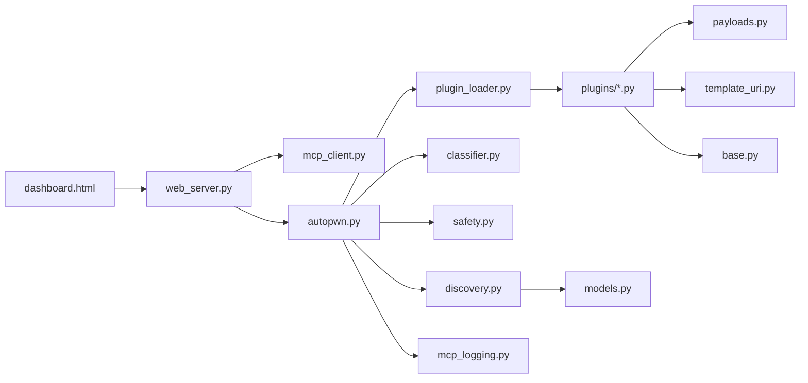

___

<div align="center">
  
### Project Layout

</div>

```
MCPhantom/
├── web_server.py          # Entry point - start here
├── dashboard.html         # Web UI
├── autopwn.py             # AutoPwn orchestrator
├── mcp_client.py          # MCP probe/enumeration helpers
├── logo.png               # Branding asset
└── audit/                 # Core auditing engine
    ├── discovery.py
    ├── classifier.py
    ├── models.py
    ├── payloads.py
    ├── safety.py
    ├── template_uri.py
    ├── mcp_logging.py
    ├── plugin_loader.py
    └── plugins/
        ├── base.py
        ├── sqli.py
        ├── cmdi.py
        ├── ssrf.py
        ├── traversal.py
        ├── idor.py
        └── infoleak.py
```

---

<div align="center">
  
### Root files

</div>

<table>
  <thead>
    <tr>
      <th>File</th>
      <th>Role</th>
      <th>Summary</th>
    </tr>
  </thead>
  <tbody>
    <tr>
      <td><code>web_server.py</code></td>
      <td>Entry point</td>
      <td>Local HTTP server on <code>127.0.0.1:1337</code>. Serves the dashboard, handles recon, AutoPwn streaming (NDJSON), and manual actions (read resource, call tool, run prompt). Suppresses harmless MCP SSE teardown log noise on startup.</td>
    </tr>
    <tr>
      <td><code>dashboard.html</code></td>
      <td>Web UI</td>
      <td>Single-page frontend: target input, discovery tables, live interaction modals (backdrop click does not dismiss), AutoPwn progress bar, findings/coverage tables, collapsible "not automatically tested" safety panel, theme toggle.</td>
    </tr>
    <tr>
      <td><code>autopwn.py</code></td>
      <td>AutoPwn engine</td>
      <td>Smart scanner that classifies capabilities, picks relevant plugins/payloads, respects safe mode limits, reuses one MCP client per scan, streams NDJSON results, reports skipped surfaces, and deduplicates findings.</td>
    </tr>
    <tr>
      <td><code>mcp_client.py</code></td>
      <td>MCP helpers</td>
      <td>Lightweight library used by the web server: <code>probe_server()</code> (connectivity check) and <code>enumerate_server()</code> (list resources, templates, tools, prompts).</td>
    </tr>
    <tr>
      <td><code>logo.png</code></td>
      <td>Asset</td>
      <td>MCPhantom logo shown in the navbar and used to generate the favicon.</td>
    </tr>
    <tr>
      <td><code>README.md</code></td>
      <td>Documentation</td>
      <td>Project overview, layout reference, and quick start instructions.</td>
    </tr>
  </tbody>
</table>

---

<div align="center">
  
### Audit engine (`audit/`)

</div>

<table>
  <thead>
    <tr>
      <th>File</th>
      <th>Role</th>
      <th>Summary</th>
    </tr>
  </thead>
  <tbody>
    <tr>
      <td><code>audit/discovery.py</code></td>
      <td>Discovery</td>
      <td>Connects to an MCP server and collects resources, resource templates, tools, and prompts into a <code>CapabilityCollection</code>. Supports sharing an existing MCP client with AutoPwn for a single connection per scan.</td>
    </tr>
    <tr>
      <td><code>audit/classifier.py</code></td>
      <td>Classifier</td>
      <td>Tags each capability (URL, COMMAND, DATABASE, PATH, ID, etc.) so AutoPwn knows which vulnerability checks to run. Treats unknown template slots and description keywords as database/SQLi surfaces where appropriate.</td>
    </tr>
    <tr>
      <td><code>audit/models.py</code></td>
      <td>Data models</td>
      <td>Shared dataclasses: <code>Capability</code>, <code>CapabilityCollection</code>, <code>Finding</code>, <code>Response</code>, and related types.</td>
    </tr>
    <tr>
      <td><code>audit/payloads.py</code></td>
      <td>Payload store</td>
      <td>Central repository of test payloads (SQLi, CMDi, SSRF, traversal, IDOR, infoleak). Includes MySQL/MariaDB <code>#</code> comment variants, system variable probes (<code>@@version</code>, <code>@@hostname</code>, etc.), and traversal evasion payloads. Extend this file to add more probes.</td>
    </tr>
    <tr>
      <td><code>audit/safety.py</code></td>
      <td>Safe mode</td>
      <td>Scan safety defaults (<code>SAFE_MODE = True</code>): blocks mutating tools (store/write/delete), limits SQLi to read-only probes on template slots, runs gentle sequential SQLi with early stop, and caps parallel checks. Set <code>SAFE_MODE = False</code> for full aggressive scanning on disposable lab targets.</td>
    </tr>
    <tr>
      <td><code>audit/template_uri.py</code></td>
      <td>Template URIs</td>
      <td>Expands and substitutes values into MCP resource template placeholders (used by manual reads, SQLi, and path traversal tests).</td>
    </tr>
    <tr>
      <td><code>audit/mcp_logging.py</code></td>
      <td>MCP logging</td>
      <td>Filters harmless <code>ClosedResourceError</code> tracebacks from the MCP HTTP/SSE client during connection teardown.</td>
    </tr>
    <tr>
      <td><code>audit/plugin_loader.py</code></td>
      <td>Plugin loader</td>
      <td>Auto-discovers plugin classes in <code>audit/plugins/</code> and returns them to AutoPwn.</td>
    </tr>
  </tbody>
</table>

---

<div align="center">
  
### Vulnerability plugins (`audit/plugins/`)

</div>

<table>
  <thead>
    <tr>
      <th>File</th>
      <th>Checks for</th>
      <th>Summary</th>
    </tr>
  </thead>
  <tbody>
    <tr>
      <td><code>plugins/__init__.py</code></td>
      <td>-</td>
      <td>Package marker for the plugins subpackage.</td>
    </tr>
    <tr>
      <td><code>plugins/base.py</code></td>
      <td>All plugins</td>
      <td>Base <code>Plugin</code> class: payload execution, MCP calls (tools/resources/templates/prompts), finding builder, response text extraction, and shared helpers.</td>
    </tr>
    <tr>
      <td><code>plugins/sqli.py</code></td>
      <td>SQL injection</td>
      <td>UNION-based probes, version/metadata extraction (<code>@@version</code>, <code>@@hostname</code>, <code>@@basedir</code>, etc.), proof scoring, fingerprint deduplication, reflection filtering, and evidence formatting.</td>
    </tr>
    <tr>
      <td><code>plugins/cmdi.py</code></td>
      <td>Command injection</td>
      <td>Shell metacharacter and allowlist-bypass payloads; parses MCP tool response text for command output.</td>
    </tr>
    <tr>
      <td><code>plugins/ssrf.py</code></td>
      <td>SSRF</td>
      <td>Probes URL/host parameters with internal and metadata-style targets (localhost, 169.254.169.254, etc.).</td>
    </tr>
    <tr>
      <td><code>plugins/traversal.py</code></td>
      <td>Path traversal</td>
      <td>Tests file-like resource templates with <code>../</code> escapes, encoding, and filter evasion. Requires passwd-style content in responses to reduce false positives. Runs only on <code>resource_template</code> surfaces.</td>
    </tr>
    <tr>
      <td><code>plugins/idor.py</code></td>
      <td>IDOR</td>
      <td>Swaps ID-like parameter values to detect unauthorized access to other records.</td>
    </tr>
    <tr>
      <td><code>plugins/infoleak.py</code></td>
      <td>Information disclosure</td>
      <td>Baseline comparison and verbose/error-triggering requests to surface sensitive data in responses.</td>
    </tr>
  </tbody>
</table>

---

<div align="center">
  
### Safe mode (default)

</div>

AutoPwn runs in **safe mode** by default to protect lab targets from accidental damage:

| Behavior | Safe mode | Full mode (`SAFE_MODE = False`) |
|---|---|---|
| Mutating tools (`store_file`, `store_password`, etc.) | Skipped | May be tested if parameters match |
| SQLi on static `resource://` URIs | Skipped | May be tested |
| SQLi on template slots (`password://{platform}`, etc.) | Read-only probes only | Full payload list |
| SQLi concurrency | Sequential, 0.4s delay, stop after first hit | Parallel |
| Parallel capability checks | Up to 2 | Up to 4 |

Skipped surfaces appear in the dashboard under **Not automatically tested** (collapsed by default). Each entry explains why it was not scanned.

Toggle safe mode in `audit/safety.py`:

```python
SAFE_MODE = False  # use only on throwaway lab targets
```

---

<div align="center">
  
### How the pieces connect

</div>



1. User opens `dashboard.html` via `web_server.py`.
2. **Start Recon** calls `mcp_client.py` to enumerate the target.
3. **AutoPwn** runs `autopwn.py`, which uses discovery, classifier, safety rules, plugins, and payloads over a shared MCP connection.
4. Results stream back to the UI as coverage rows, vulnerability findings, and a list of deliberately skipped surfaces.

---

<div align="center">
  
### Quick start

</div>

```bash
python web_server.py
```

Open [http://127.0.0.1:1337](http://127.0.0.1:1337), enter your MCP target URL, run **Start Recon**, then **AutoPwn**.

---

<div align="center">
  
### Adding or changing behavior

</div>

<div align="center">

| Goal | File to edit |
|---|---|
| Add payloads | `audit/payloads.py` |
| Add a new vulnerability type | New file in `audit/plugins/` + inherit from `base.Plugin` |
| Change what gets tested | `audit/classifier.py`, `audit/safety.py`, `autopwn.py` |
| Toggle safe vs full scan | `audit/safety.py` (`SAFE_MODE`) |
| Change UI layout or streaming | `dashboard.html` |
| Add API endpoints | `web_server.py` |

</div>

___
<div align="center">
  
<a href="https://madebyhuman.iamjarl.com"></a>

</div>
